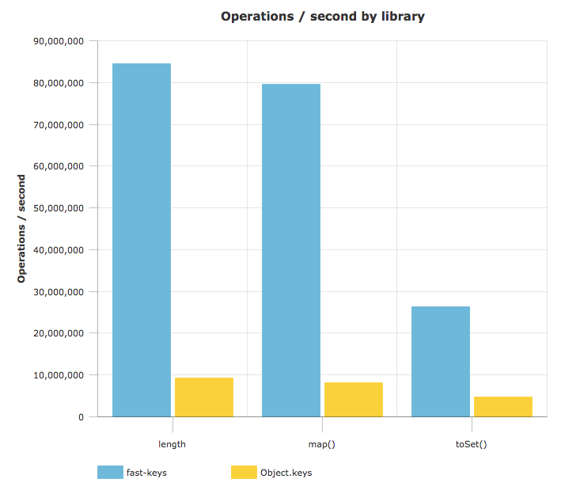

# 🔑 `fast-keys`

[](https://travis-ci.org/b-gran/fast-keys) [](https://badge.fury.io/js/fast-keys) [](https://github.com/b-gran/fast-keys)

`fast-keys` is a highly performant alternative to `Object.keys`.
Its API has many of the same methods as `Array.prototype`, plus a few additional helpers.

* ⏩ 🏎 Really, really fast
* 🧠 Less heap allocation and garbage collection than `Object.keys`
* 🛠️ Extra utility methods

# Why should I use this?

`Object.keys` has a significant performance cost. It's extremely common to use `Object.keys` to determine the number of keys in an object:
```javascript
const object = { foo: 1, bar: 1, baz: 1 }
const keyLength = Object.keys(object).length
```

In order to determine the key length, the runtime will allocate an array containing all of the object's keys and then return the length of the array.
For applications where performance is important, the cost of these array allocations quickly adds up.
Not only is the array allocation expensive, the runtime will need to perform additional garbage collection to clean up the arrays.

Of course, it's possible to do explicit object key iteration in performance-critical applications - but by doing so we aren't able to use many of the useful functional tools available in the Javascript ecosystem.

This library provides the best of both worlds: the familiar functional-style `Object.keys` and `Array.prototype` interfaces without the performance costs of unnecessary Array allocations or garbage collection.

# How fast is it?

It's about **8-10x faster** than using `Object.keys`, depending on the properties of the objects and the `Array.prototype` methods.
It also uses much less memory and requires less garbage collection, so the performance might be even better depending on your application.

### Benchmarks
https://jsperf.com/fast-keys



# Examples

```javascript
import K from 'fast-keys'

const object = { foo: 1, bar: 1, baz: 1 }

console.log(K(object).length) // 3

console.log(K(object).map(string => string + '2')) // [ 'foo2', 'bar2', 'baz2' ]

console.log(K(object).toSet()) // Set { 'foo', 'bar', 'baz' }
```

`fast-keys` has many of the `Array.prototype` methods, and some extra helpers too.

# API Reference

## `function K()`
The default export of the module.

Accepts any non-nil value and returns a [`IFastKeys`](#ifastkeys) instance.

```typescript
function K <ObjectType> (object: ObjectType): IFastKeys<ObjectType>
```

## `IFastKeys`
The interface that exposes the `Array.prototype` methods.

```typescript
interface IFastKeys <ObjectType> {
    length: number;

    some(iteratee: Predicate<ObjectType>): boolean
    map<A>(iteratee: (key: keyof ObjectType) => A): Array<A>
    toSet(): Set<keyof ObjectType>
    every(iteratee: Predicate<ObjectType>): boolean
    filter(iteratee: Predicate<ObjectType>): Array
    forEach(iteratee: (key: keyof ObjectType) => void): void
    find(predicate: Predicate<ObjectType>): keyof ObjectType | undefined
}

type Predicate <ObjectType> = (key: keyof ObjectType) => boolean
```

<table>
<thead>
<td>

[`length`](#ifastkeyslength)

</td>
<td>

[`some()`](#ifastkeyssome)

</td>
<td>

[`map()`](#ifastkeysmap)

</td>
<td>

[`toSet()`](#ifastkeystoset)

</td>
<td>

[`every()`](#ifastkeysevery)

</td>
<td>

[`filter()`](#ifastkeysfilter)

</td>
<td>

[`forEach()`](#ifastkeysforeach)

</td>
<td>

[`find()`](#ifastkeysfind)

</td>
</thead>
</table>

`IFastKeys` predicates are only passed the key **and are not passed the index or the entire array of keys.**

All functions only operate on keys that are **own, enumerable, and string**. This is the same behavior as `Object.keys`.
Non-enumerable, inherited, and Symbol keys will be skipped.

`IFastKeys` instances don't cache or pre-compute the results of any calls, so you can use the same `IFastKeys` instance even if the underlying object changes.
For example:
```javascript
import K from 'fast-keys'

const object = { foo:1 }
const fkObject = K(object)

console.log(fkObject.length) // 1

object.bar = 1

console.log(fkObject.length) // 2
```

## `IFastKeys.length`
<sup><a href="https://developer.mozilla.org/en-US/docs/Web/JavaScript/Reference/Global_Objects/Array/length">MDN</a></sup>
The number of **own** (i.e. non-inherited) **enumerable string** keys of the object.

## `IFastKeys.some`
<sup><a href="https://developer.mozilla.org/en-US/docs/Web/JavaScript/Reference/Global_Objects/Array/some">MDN</a></sup>
Returns true if at least one key satisfies the predicate.
Short-circuits and returns immediately if a key satisfies the predicate.

```typescript
function some (iteratee: (key: string) => boolean): boolean
```

## `IFastKeys.map`
<sup><a href="https://developer.mozilla.org/en-US/docs/Web/JavaScript/Reference/Global_Objects/Array/map">MDN</a></sup>
Returns a new Array containing the results of applying the iteratee to each key in the object.

```typescript
function map <A> (iteratee: (key: string) => A): Array<A>
```

## `IFastKeys.toSet`
Returns a Set containing the object's keys. Equivalent to `new Set(Object.keys(object))`.

```typescript
function toSet (): Set<string>
```

## `IFastKeys.every`
<sup><a href="https://developer.mozilla.org/en-US/docs/Web/JavaScript/Reference/Global_Objects/Array/every">MDN</a></sup>
Returns true if every key satisfies the predicate.
Short-circuits and returns immediately if a key fails.

```typescript
function every (iteratee: (key: string) => boolean): boolean
```

## `IFastKeys.filter`
<sup><a href="https://developer.mozilla.org/en-US/docs/Web/JavaScript/Reference/Global_Objects/Array/filter">MDN</a></sup>
Returns a new Array containing only the keys that satisfy the predicate.

```typescript
function filter (iteratee: (key: string) => boolean): Array<string>
```

## `IFastKeys.forEach`
<sup><a href="https://developer.mozilla.org/en-US/docs/Web/JavaScript/Reference/Global_Objects/Array/forEach">MDN</a></sup>
Execute some function for each key in the object. An opportunity to do side effects for each key.

```typescript
function forEach (iteratee: (key: string) => void): void
```

## `IFastKeys.find`
<sup><a href="https://developer.mozilla.org/en-US/docs/Web/JavaScript/Reference/Global_Objects/Array/find">MDN</a></sup>
Returns the first key that satisfies the predicate, or returns `undefined`.
Short-circuits and returns immediately if a matching key is found.

```typescript
function find (iteratee: (key: string) => boolean): string | undefined
```
